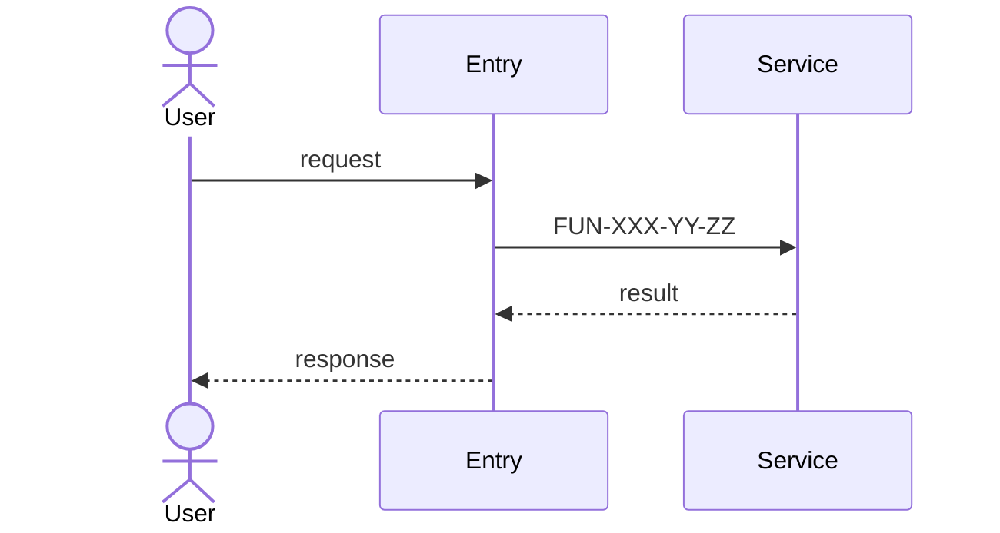
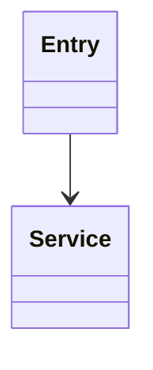
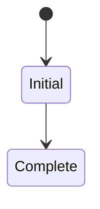
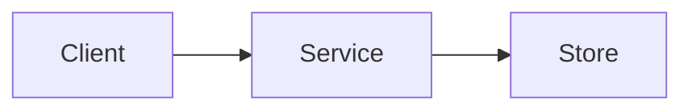

# Design: FTR-XXX-YY — <Feature Title>

> Copy to `/cdase/requirements/SCN-XXX/FTR-YY/design.md`.
> This document is mandatory for every Feature and is the authoritative design
> narrative. **Every design diagram MUST be included in this file.** Standalone
> diagram files are supplementary and do not satisfy the Design Gate.

## 0. Metadata
- Feature: FTR-XXX-YY (`feature.md`)
- Design Version: v0.1
- Last Updated: <YYYY-MM-DD>
- Authors: <names/teams>

## 1. Goals and Non-Goals

### Goals
- ...

### Non-Goals
- ...

## 2. Context and Constraints
- Existing system context: ...
- Technical constraints: ...
- Compatibility constraints: ...
- Security/privacy constraints: ...

## 3. Design Overview
<Describe the chosen architecture and why it satisfies the Feature contract.>

## 4. Component Responsibilities

| Component / Module | Responsibility | Functions / APIs |
|---|---|---|
| ... | ... | FUN-... / `<API>` |

## 5. Data and State
- Data model: ...
- State transitions: ...
- Persistence/transaction boundary: ...
- Migration/compatibility: ...

## 6. Flow Design

### Main Flow
1. <Map to `feature.md` journey step and Function ID>
2. ...

### Error and Edge Flows
1. <condition → handling → observable result>

### Concurrency / Retry / Idempotency (when relevant)
- ...

## 7. Diagrams
> Include every relevant diagram here using Mermaid, PlantUML, or another
> repository-renderable text format. Delete diagram subsections that are truly
> not applicable and record the reason in §11.

### 7.1 Feature Sequence (Required)

### 7.2 Component / Class View (When structure matters)

### 7.3 State View (When lifecycle matters)

### 7.4 Deployment / Integration View (When topology matters)

## 8. Function and Contract Mapping

| Journey Step | Function ID | API/SPI | Design Section |
|---|---|---|---|
| 1 | FUN-XXX-YY-ZZ | `<signature>` | §6 / §7.1 |

## 9. Acceptance-Criteria Coverage

| FAC ID | Design Handling | Diagram / Flow | Verification |
|---|---|---|---|
| FAC-01 | ... | §6 / §7.1 | `<test path/name>` |

## 10. Decisions and ADRs
- ADR-XXX: `<repo-relative path>` — <decision summary>
- Inline decision (small): <decision + rationale>

## 11. Risks, Trade-offs, and Open Questions

| ID | Type | Description | Mitigation / Resolution |
|---|---|---|---|
| R-01 | Risk | ... | ... |
| T-01 | Trade-off | ... | ... |
| Q-01 | Open Question | ... | ... |

## 12. Trace Links
- Feature definition: `feature.md`
- Feature gates: `gates.md`
- Feature progress: `progress.md`
- Feature code plan: `code-plan.md`
- Function folders: `FUN-ZZ/`
- API registry: `/cdase/api/...`
