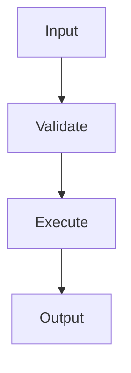
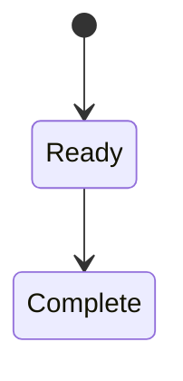

# Design: FUN-XXX-YY-ZZ — <Function Title>

> Copy to `/cdase/requirements/SCN-XXX/FTR-YY/FUN-ZZ/design.md`.
> This file is **conditional**. Create it only when the parent `../design.md`
> does not fully specify the Function's internal algorithm, state, concurrency,
> security, integration, or data design. Every Function-specific diagram MUST
> be included here.

## 0. Metadata
- Function: FUN-XXX-YY-ZZ (`function.md`)
- Parent Feature Design: `../design.md`
- Design Version: v0.1
- Last Updated: <YYYY-MM-DD>
- Authors: <names/teams>
- Reason Separate Design Is Required: <complexity not covered by parent>

## 1. Goals and Constraints
- Goal: ...
- Constraints/invariants: ...
- Parent-design boundary: ...

## 2. Internal Design
- Algorithm / control flow: ...
- Data transformations: ...
- State and persistence: ...
- Dependency interactions: ...

## 3. Error, Concurrency, and Security Design
- Error mapping: ...
- Retry/idempotency: ...
- Concurrency/transactions: ...
- Security/privacy: ...

## 4. Diagrams
> Include all Function diagrams here. Do not rely on an orphan diagram file.

### 4.1 Internal Sequence / Activity

### 4.2 Data / State View (When relevant)

## 5. Acceptance-Criteria Coverage

| AC ID | Design Handling | Diagram / Section | Verification |
|---|---|---|---|
| AC-01 | ... | §2 / §4.1 | `<test path/name>` |

## 6. Decisions, Risks, and Open Questions
- Decision: ...
- Risk: ...
- Open question: ...

## 7. Trace Links
- Function contract: `function.md`
- Parent Feature design: `../design.md`
- Gates: `gates.md`
- Progress: `progress.md`
- Code Plan: `code-plan.md`
- API registry: `/cdase/api/...`
